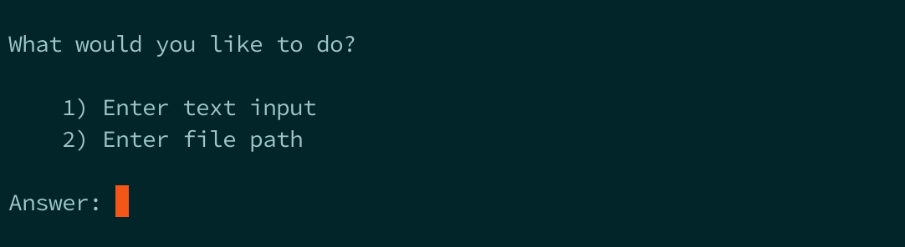
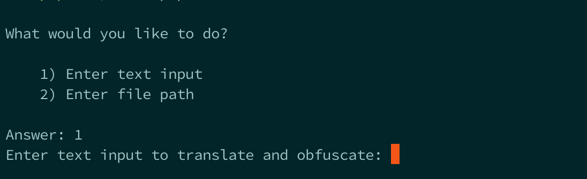
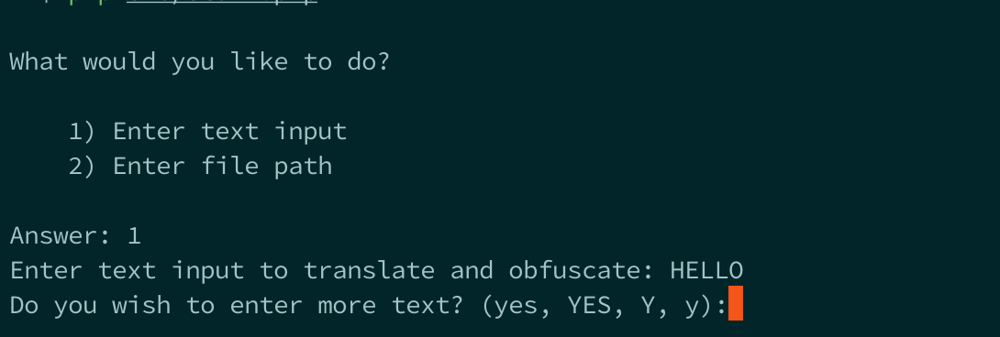
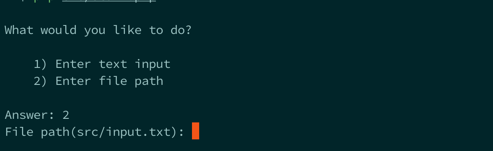

# PHP Coding Tasks

The repository is home to the following coding tasks.

* Flatten an Arbitrarily Nested Integer Array
* Morsecode Translator and Obfuscator

Both tasks consist of PHP files and their respective tests.

The Morsecode component has 2 additional PHP files called `stdin.php` and `stdinFunctions.php`. Some functions 
in `stdin.php` where extracted into `stdinFunctions.php` to make them testable. `stdin.php` takes input in the form of 
plain text or a file path from `STDIN`.

## Getting Started

To get started clone the Github repository on your development machine and refer to the _Installation_ instructions 
in this document.

### Prerequisites

* `PHP 5.6.11` - Please note that I did NOT test in any other version of PHP
* Composer `1.2.1`

### Installation

Use [Composer](https://getcomposer.org/) to install project dependencies. All dependencies are defined in the 
`composer.json` file.

Install dependencies:
```
composer install
```

### Running Scripts

The Morsecode Translator and Obfuscator has an additional PHP script that can be invoked through the PHP CLI. 
It takes input in the form of plain text or a file path from `STDIN`.

Run the script:
```
php src/stdin.php
```
When running the script you will be prompted to enter `1` or `2` depending on the type of input you desired to provide.
`1` is for plain text input and `2` is for file input.

Prompt


Both options has the ability to accept an arbitrarily amount of input parameters. 

To translate an arbitrary amount of input, follow these instructions:

**Plain text input** - For the plain text input, run the `src/stdin.php` script and follow the on screen instructions

Prompt for plain text input


Prompt to parse another plain text input


**File input** - For file input, add additional lines of plain text to `src/input.txt` and run the `src/stdin.php` script. Then choose 
option `2` for file input. The program will read all the lines from the `src/input.txt` file and parse it.

Prompt for file input


### Running Tests

#### Overview

The tests for the tasks where written in [phpspec](http://www.phpspec.net/en/stable/) and 
[PHPUnit](https://phpunit.de/manual/5.7/en/index.html).

#### Flatten an Arbitrarily Nested Integer Array

The Flatten an Arbitrarily Nested Integer Array has one test file.

It is located here:

* _spec/ArrayHelperSpec.php_
 
 Run the tests:
 ```
 bin/phpspec run spec/ArrayHelperSpec.php
 ```

#### Morsecode Translator and Obfuscator

The Morsecode Translator and Obfuscator has 2 sets of tests for their respective classes.

They are located here:

* _spec/MorseCodeTranslatorSpec.php_
* _spec/MorseCodeObfuscatorSpec.php_

Run the _MorseCodeTranslator_ tests:
```
bin/phpspec run spec/MorseCodeTranslatorSpec.php
```

Run the _MorseCodeObfuscator_ tests:
```
bin/phpspec run spec/MorseCodeObfuscatorSpec.php
```

##### STDIN PHP Script for Morsecode Translator and Obfuscator

Tests for `stdinFunctions.php` are written in PHPUnit and is located here:

* `tests/StdinTest.php`

Run the _stdinFunctions_ tests:
```
bin/phpunit --bootstrap vendor/autoload.php tests/StdinTest.php
```

#### All phpspec tests

Run _all_ tests:
```
bin/phpspec run
```

#### All PHPUnit tests

Run _all_ tests:
```
bin/phpunit --bootstrap vendor/autoload.php tests
```

## Authors

* **Bjorn Theart**

## License

This project is licensed under the MIT License - see the [LICENSE.md](LICENSE.md) file for details
